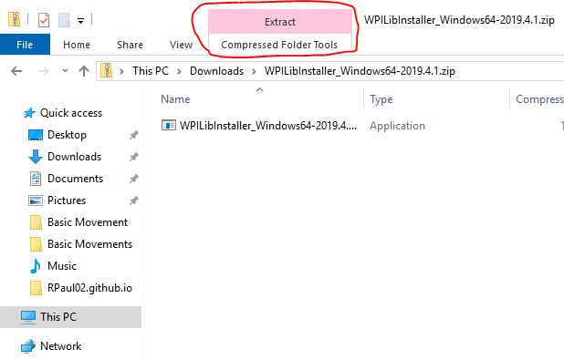
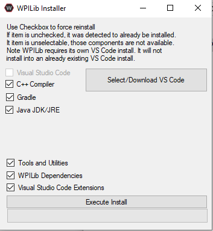
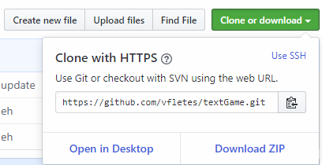

# Guide to getting started

## Setting up your environment

There are several things that you'll need to download in order to get started, this will explain how to download all of the programs that you may need.

### WPILIB Package

The most essential thing you'll need to get started is the WPILIB Package, found on [this page](https://github.com/wpilibsuite/allwpilib/releases) You’ll want to download the file from the assets called WPILIBInstaller_Window64 (it may have some numbers on the end to indicate the version).

Once it’s downloaded you’ll need to click on the file. It’ll open up in file explorer and you’ll see something similar to this.

Click on `compressed folder tools > extract all > extract` then once it is done copying the file, double click on the executable in the newly opened window and click run on the security warning. Then click current user.

You should see this. From here click on Select/Download VS Code and then Download. After VS Code has downloaded all you need to do is click on execute install and it will install the rest of the WPILIB elements.

### Git

Another program that is essential to our workflow is Git. The download can be found [here](https://git-scm.com/download/win). Once it’s downloaded just rapidly click through the setup until it gets to the install. The settings there only affect the command line git, which we do not use.

## GitHub
If you would like to work on your robotics programming skills at home or want to code in the robotics team, then setting up a GitHub account is necessary. First you will need to go to github.com and sign up. From there all you will need to do is follow the site’s instructions for setting up an account. If you would like to become a member of the CarmelRobotics organization on GitHub, ask an owner of the organization in person or ask Clifford to invite you.

### Cloning, Committing, and Pushing
Cloning and pulling are very similar and essentially save code from a GitHub repository onto your computer, specifically onto Visual Studio Code. The difference between cloning and pulling, however is that cloning is the first time a person would download the code onto their Visual Studio Code, while pulling is updating their version of the code to what is on GitHub's website. First copy the URL of the repository by opening the desired repository and clicking the clone or download repository and copying the URL. 

In order to clone, you will have to have Visual Studio Code opened and press CTRL + SHIFT + P to pull up the Command Palette then type "Clone" and click on `Git: Clone Repository`, then paste the URL and press enter.

Once you've made changes to the code of the robot you'll want to then save them so they can later be uploaded. To do this you can go to the source control tab in Visual Studio Code.

In order to upload your commits to Github pull up the command palette, then type “Push”, and click `Git: Push`. This will come up with an error if there are any conflicts on the github, so be careful to not work on the same branch as someone else at the same time!

## Ready to Code
You are now ready to start coding the robot. From here, if you aren't familiar with Java you can use [CodeCademy](https://www.codecademy.com/learn/learn-java) to get the basics down. If you have any questions, ask the more senior members. Have fun!
