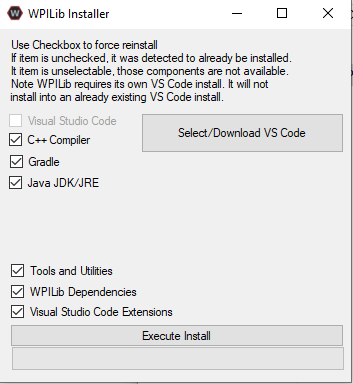

# Downloading Visual Studio and GIT

There are several things that you'll need to download in order to get started, this will explain how to download all of the programs that you may need.

## WPILIB Package/ Visual Studio

The most essential thing you'll need to get started is the WPILIB Package, found on [this page](https://github.com/wpilibsuite/allwpilib/releases) You’ll want to download the file from the assets called WPILIBInstaller_Window64 (it may have some numbers on the end to indicate the version).

Once it’s downloaded you’ll need to click on the file. It’ll open up in file explorer and you’ll see something similar to this.

Click on `compressed folder tools > extract all > extract` then once it is done copying the file, double click on the executable in the newly opened window and click run on the security warning. Then click current user.

You should see this. From here click on Select/Download VS Code and then Download. After VS Code has downloaded all you need to do is click on execute install and it will install the rest of the WPILIB elements.

## Git

Another program that is essential to our workflow is Git. The download can be found [here](https://git-scm.com/download/win). Once it’s downloaded just rapidly click through the setup until it gets to the install. The settings there only affect the command line git, which we do not use.

## When You Are Done

When you finish downloading and installing these programs, go to the file titled "Starting-With-GitHub" to find out how to use GitHub.
