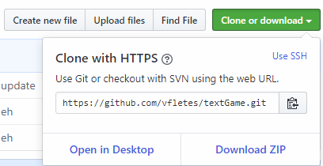

# Starting with GitHub

If you have not read the README and set up Visual Studio and GIT already, please do that.

If you would like to work on your robotics programming skills at home or want to code in the robotics team, then setting up a GitHub account is necessary. First you will need to go to github.com and sign up. From there all you will need to do is follow the site’s instructions for setting up an account. If you would like to become a member of the CarmelRobotics organization on GitHub, ask an owner of the organization in person or ask Clifford to invite you.

Here are instructions on how to fork, clone, commit, push, and pull using GitHub.

## Forking
To create a copy of the master code that you can work on, you should create a fork. Once you do this, your edits will not affect the master code.

The first step to fork code is to go to the upper right corner of the repository you would like to fork. There, click on the button that says "Fork." This is what it should look like:

Next, you should see this tab:

Click on your username to create your personal fork of the code. 

If you see this, it means you have successfully made a fork:

## Cloning
Cloning saves code from a GitHub repository onto your computer, specifically onto Visual Studio Code. Cloning is used the first time a person downloads the code onto their Visual Studio Code. First copy the URL of the repository by opening the desired repository and clicking the clone or download repository and copying the URL. 

In order to clone, you will have to have Visual Studio Code opened and press CTRL + SHIFT + P to pull up the Command Palette then type "Clone" and click on `Git: Clone Repository`, then paste the URL and press enter.

## Commiting/Pushing
Once you've made changes to the code of the robot you'll want to then save them to the Github repository. This is called commiting. To do this, go to the source control tab in Visual Studio Code.

Once you're in this tab you'll see something like this:

You'll want to press on the plus that pops up when you hover over the file (in this case Example.java) which will "stage" your file. Write a comment into the message box that describes what you've done so far, and press the check to commit it.

In order to upload your commits to Github pull up the command palette, then type “Push”, and click `Git: Push`. This will come up with an error if there are any conflicts on the github, so be careful to not work on the same branch as someone else at the same time!

## Pulling
To update your fork to edits made in the master code, pulling is required. The first step is to go to your fork and make a pull request by clicking the button shown below.

You may see this (if you don't, skip this step):

This happens if you tried making a pull request directly from the master code. Select "compare across forks" and choose your fork to continue. You will probably see this:

The green check means that there are no conflicts between your code and the master code. Title your request and click the button to create a pull request. If there are any merge conflicts, you may still want to submit a request since an owner of the master code will resolve them. Otherwise, the code will automatically be merged once they approve your request. 

## Deleting a Fork
It is only possible to have one fork at a time, so there will be times when you have to delete a fork. To do so, click on "Settings," as shown below.

Scroll all the way to the bottom until you reach the "Danger Zone." Select the option to delete your fork.

## Ready to Code
You are now ready to start coding the robot. From here, if you aren't familiar with Java you can use [CodeCademy](https://www.codecademy.com/learn/learn-java) to get the basics down. From there if you have any questions, just ask the more senior members. Have fun!

Other good resources for coding are https://docs.wpilib.org/en/latest/ and https://first.wpi.edu/FRC/roborio/release/docs/java/index.html

